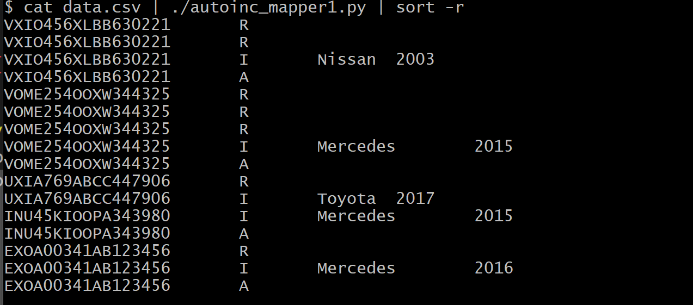
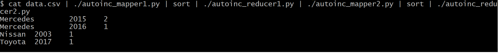

# SP_mini-project_hadoop
## Post Sale Automobile Report

Image by: Tesla

## Table of contents
* [What is this?](#what-is-this)
* [How to use this?](#how-to-use-this)
* [Technologies](#technologies)
* [Setup](#setup)
* [Local Execution](#local-execution)


## What is this?
In this project, I will utilize data from an automobile tracking platform that tracks the history of important incidents after the initial sale of a new vehicle. Such incidents include subsequent private sales, repairs, and accident reports. The platform provides a good reference for second-hand buyers to understand the vehicles they are interested in.


## How to use this?
In this project, I will receive a dataset with a history report of various vehicles. The goal is to write a MapReduce program to produce a report of the total number of accidents per make and year of the car.


## Technologies
Project is created with:

- Hortonworks HDP Sandbox 3.0.0
- Python 3.8+

========================================================
========================================================

## Setup

- Update the below line in the python files to run locally  

```
#!<local_path_to_python.exe>

```
- Update the below line in the python files to run on Hadoop

```
#!/usr/bin/env python

```


## Local Execution

__Output of Mapreduce program__

* __Mapper1 Output__


* __Reducer1 Output__


* __Mapper2 Output__


* __Reducer2 Output__



## HadoopExecution

* Execution in Hadoop Distributed Environment

> __1. Move the mapreduce files to /home/hdfs and assign permissions__

```
chmod +x /home/hduser/autoinc_mapper*.py

chmod +x /home/hduser/autoinc_reducer*.py

```

> __2. Create a folder in HDFS and move the data.csv file__

```
hdfs dfs -mkdir /<datafolder>

```

> __3. Move the data.csv to the datafolder in HDFS__

```
hdfs dfs -put <local_path>/data.csv /<datafolder>/

```

> __4. Create bashscript 'mapreduce1.sh' to execute the first set of mapreduce code__

```
hadoop jar /usr/hdp/current/hadoop-mapreduce-client/hadoop-streaming.jar \
-file /home/hdfs/autoinc_mapper1.py    -mapper /home/hdfs/autoinc_mapper1.py \
-file /home/hdfs/autoinc_reducer1.py   -reducer /home/hdfs/autoinc_reducer1.py \
-input /<datafolder>/data.csv \
-output /output

```


```
sh mapreduce.sh

```

> __5. After execution, the output will be saved to the 'output folder'__

```
[hdfs@sandbox-hdp ~]$ hdfs dfs -cat /output/part-00000                                                                                                                                                            
EXOA00341AB123456       Mercedes   2016
INU45KIOOPA343980       Mercedes   2015                
UXIA769ABCC447906       Toyota     2017                               
VOME254OOXW344325       Mercedes   2015                      
VXIO456XLBB630221       Nissan     2003
```

Note:
- Repeat the same steps for mapreduce1.sh
- The output should be as follows:

```
[hdfs@sandbox-hdp ~]$ hdfs dfs -cat /accidents_count_per_make_year/part-00000                                                                                                                                           
Toyota          2017    1                                                              
Mercedes        2016    1                                                    
Mercedes        2015    2                               
Nissan          2003    1       
```
___
